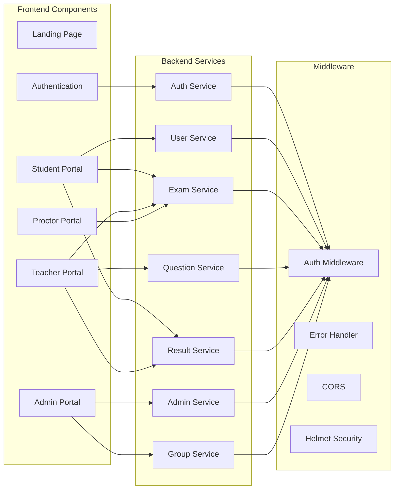
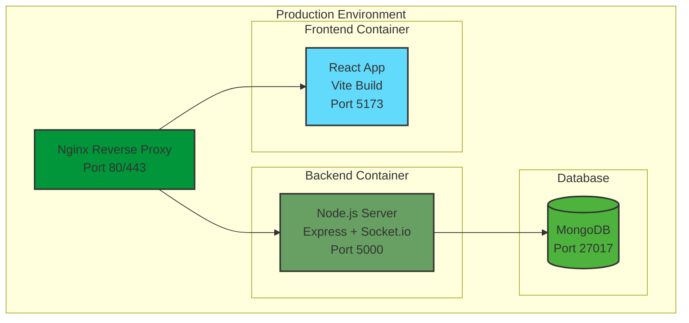
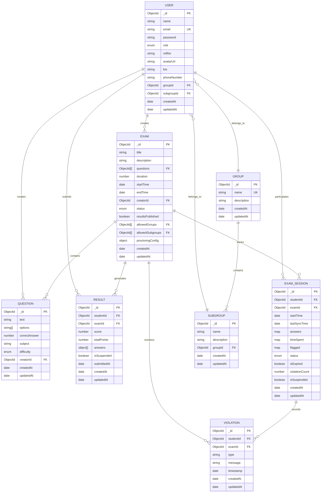

# SOEMS - Software Requirements Specification Document
## Online Examination Management System

---

## Document Information

| **Field** | **Details** |
|-----------|-------------|
| **Project Name** | SOEMS - Serverless Online Examination Management System |
| **Version** | 1.0.0 |
| **Document Type** | Software Requirements Specification (SRS) |
| **Prepared By** | Project Documentation Team |
| **Date** | January 6, 2026 |
| **Technology Stack** | MERN Stack (MongoDB, Express.js, React, Node.js) with TypeScript |

---

## Table of Contents

1. [Introduction](#1-introduction)
2. [System Overview](#2-system-overview)
3. [System Architecture](#3-system-architecture)
4. [Database Design](#4-database-design)
5. [Functional Requirements](#5-functional-requirements)
6. [Technology Stack](#6-technology-stack)
7. [API Endpoints](#7-api-endpoints)
8. [Security Features](#8-security-features)
9. [Real-time Features](#9-real-time-features)
10. [User Interfaces](#10-user-interfaces)

---

## 1. Introduction

### 1.1 Purpose
SOEMS (Serverless Online Examination Management System) is a comprehensive web-based platform designed to facilitate secure, efficient, and real-time online examinations. The system provides dedicated portals for Students, Teachers, Administrators, and Proctors, enabling seamless exam creation, administration, monitoring, and result analysis.

### 1.2 Scope
The system encompasses:
- **User Management**: Multi-role authentication and authorization
- **Exam Management**: Complete exam lifecycle from creation to archival
- **Question Bank**: Centralized repository for questions with difficulty levels
- **Real-time Proctoring**: Live monitoring with violation detection
- **Analytics & Reporting**: Comprehensive performance insights
- **Group Management**: Student organization into groups and subgroups

### 1.3 Definitions and Acronyms

| **Term** | **Definition** |
|----------|----------------|
| **SOEMS** | Serverless Online Examination Management System |
| **MERN** | MongoDB, Express.js, React, Node.js |
| **JWT** | JSON Web Token |
| **REST** | Representational State Transfer |
| **SRS** | Software Requirements Specification |
| **MCQ** | Multiple Choice Question |
| **ODM** | Object Document Mapper (Mongoose) |

---

## 2. System Overview

### 2.1 System Description
SOEMS is a full-stack web application built using the MERN stack with TypeScript for type safety. The system implements a role-based access control (RBAC) mechanism supporting four distinct user roles:

1. **Student**: Take exams, view results, manage profile
2. **Teacher**: Create exams, manage questions, analyze results
3. **Admin**: User management, system monitoring, global oversight
4. **Proctor**: Real-time exam monitoring, violation tracking

### 2.2 Key Features

#### 2.2.1 Student Features
- **Dashboard**: View upcoming and completed exams
- **Secure Exam Interface**: 
  - Full-screen enforcement
  - Tab lock mechanism
  - Real-time timer with auto-submission
  - Question navigation and flagging
- **Results & Analytics**: Instant score viewing with detailed breakdowns
- **Profile Management**: Update personal information

#### 2.2.2 Teacher Features
- **Exam Creation Wizard**: 
  - Multi-step exam builder
  - Question bank integration
  - Duration and scheduling
  - Group/subgroup targeting
- **Question Management**: 
  - Create, edit, delete questions
  - Categorize by subject and difficulty
  - Bulk import via CSV
- **Analytics Dashboard**:
  - Score distribution charts
  - Question-level analysis
  - Student performance tracking
  - AI-powered insights
- **Report Generation**: Export results to CSV

#### 2.2.3 Admin Features
- **User Management**:
  - Create, update, delete users
  - Bulk import via CSV
  - Role assignment
- **Live Monitoring**: Real-time exam proctoring dashboard
- **System Health**: Monitor server and database status
- **Group Management**: Organize students into groups/subgroups

#### 2.2.4 Proctor Features
- **Live Exam Monitoring**: Real-time student activity tracking
- **Violation Alerts**: Instant notifications for suspicious behavior
- **Session Management**: View active exam sessions

---

## 3. System Architecture

### 3.1 High-Level Architecture

The system follows a three-tier architecture:

```mermaid
graph TB
    subgraph "Client Layer"
        A[React Frontend<br/>TypeScript + Tailwind CSS]
    end
    
    subgraph "Application Layer"
        B[Express.js Server<br/>TypeScript + Node.js]
        C[Socket.io Server<br/>Real-time Communication]
    end
    
    subgraph "Data Layer"
        D[(MongoDB Database<br/>Mongoose ODM)]
    end
    
    subgraph "External Services"
        E[JWT Authentication]
        F[File Upload Service<br/>Multer]
    end
    
    A <-->|REST API<br/>HTTP/HTTPS| B
    A <-->|WebSocket<br/>Real-time Events| C
    B --> D
    C --> D
    B --> E
    B --> F
    
    style A fill:#61dafb,stroke:#333,stroke-width:2px
    style B fill:#68a063,stroke:#333,stroke-width:2px
    style C fill:#010101,stroke:#333,stroke-width:2px
    style D fill:#4db33d,stroke:#333,stroke-width:2px
```

### 3.2 Component Architecture

### 3.3 Deployment Architecture

---

## 4. Database Design

### 4.1 Database Schema Overview

The system uses MongoDB with Mongoose ODM for data modeling. The database consists of 8 primary collections:

### 4.2 Collection Details

#### 4.2.1 User Collection
- **Purpose**: Store all user information with role-based discriminators
- **Discriminators**: Student, Teacher, Admin, Proctor
- **Key Features**:
  - Password hashing with bcrypt (salt rounds: 10)
  - Email uniqueness constraint
  - Roll number validation (13 digits for students)
  - Phone number validation (10 digits)
  - Security questions for staff roles

#### 4.2.2 Exam Collection
- **Purpose**: Store exam metadata and configuration
- **Status Values**: draft, published, archived, closed
- **Proctoring Config**:
  - Tab lock enforcement
  - Fullscreen requirement
  - Input lock mechanism
  - Violation threshold (default: 5)

#### 4.2.3 Question Collection
- **Purpose**: Centralized question bank
- **Difficulty Levels**: easy, medium, hard
- **Validation**: Minimum 2 options required
- **Answer Storage**: Index-based (0-3)

#### 4.2.4 Result Collection
- **Purpose**: Store exam submissions and scores
- **Unique Constraint**: One result per student per exam
- **Answer Tracking**:
  - Question ID
  - Selected option
  - Correctness flag
  - Time spent per question

#### 4.2.5 ExamSession Collection
- **Purpose**: Track active exam sessions
- **Real-time Sync**: Last sync timestamp
- **State Management**:
  - Answers map (questionId → selectedOption)
  - Time spent map (questionId → seconds)
  - Flagged questions map
- **Violation Tracking**: Count and suspension status

#### 4.2.6 Violation Collection
- **Purpose**: Log proctoring violations
- **Violation Types**:
  - Tab switch
  - Fullscreen exit
  - Multiple faces detected
  - No face detected
  - Copy/paste attempt

#### 4.2.7 Group & Subgroup Collections
- **Purpose**: Organize students hierarchically
- **Use Cases**:
  - Department-wise grouping
  - Class/section organization
  - Targeted exam assignment

---

## 5. Functional Requirements

### 5.1 Authentication & Authorization

#### 5.1.1 User Registration
- **Endpoint**: `POST /api/auth/register`
- **Functionality**:
  - Email validation and uniqueness check
  - Password strength validation
  - Role assignment
  - Automatic password hashing
  - JWT token generation

#### 5.1.2 User Login
- **Endpoint**: `POST /api/auth/login`
- **Functionality**:
  - Email and password verification
  - Password comparison using bcrypt
  - JWT token generation with 30-day expiry
  - User data serialization (excluding password)

#### 5.1.3 Password Recovery
- **Endpoint**: `POST /api/auth/forgot-password`
- **Functionality**:
  - Security question verification
  - Password reset capability
  - Answer hashing for security

#### 5.1.4 Protected Routes
- **Middleware**: `authMiddleware`
- **Functionality**:
  - JWT token verification
  - User authentication status check
  - Role-based access control
  - Token expiry handling

### 5.2 Student Module

#### 5.2.1 View Available Exams
- **Endpoint**: `GET /api/exams/student/available`
- **Functionality**:
  - Filter exams by student's group/subgroup
  - Show only published exams
  - Display exams within valid time range
  - Exclude already attempted exams

#### 5.2.2 Start Exam
- **Endpoint**: `POST /api/exams/:id/start`
- **Functionality**:
  - Validate exam eligibility
  - Check time constraints
  - Create exam session
  - Load questions (shuffled if configured)
  - Initialize timer
  - Emit socket event for monitoring

#### 5.2.3 Submit Answer
- **Endpoint**: `POST /api/exams/:id/submit-answer`
- **Functionality**:
  - Validate session status
  - Update answer in session
  - Track time spent per question
  - Sync to database
  - Real-time progress update

#### 5.2.4 Submit Exam
- **Endpoint**: `POST /api/exams/:id/submit`
- **Functionality**:
  - Calculate total score
  - Evaluate each answer
  - Create result document
  - Update session status
  - Emit socket event
  - Return immediate feedback (if enabled)

#### 5.2.5 View Results
- **Endpoint**: `GET /api/results/student/:studentId`
- **Functionality**:
  - Fetch all student results
  - Populate exam details
  - Calculate percentage
  - Show detailed answer breakdown

### 5.3 Teacher Module

#### 5.3.1 Create Question
- **Endpoint**: `POST /api/questions`
- **Functionality**:
  - Validate question structure
  - Ensure minimum 2 options
  - Validate correct answer index
  - Associate with creator
  - Store in question bank

#### 5.3.2 Bulk Import Questions
- **Endpoint**: `POST /api/questions/bulk-import`
- **Functionality**:
  - Parse CSV file
  - Validate each question
  - Batch insert to database
  - Return success/failure report

#### 5.3.3 Create Exam
- **Endpoint**: `POST /api/exams`
- **Functionality**:
  - Validate exam metadata
  - Select questions from bank
  - Set duration and schedule
  - Configure proctoring settings
  - Assign to groups/subgroups
  - Set status (draft/published)

#### 5.3.4 Update Exam
- **Endpoint**: `PUT /api/exams/:id`
- **Functionality**:
  - Validate ownership
  - Prevent modification of published exams
  - Update exam details
  - Modify question list
  - Adjust scheduling

#### 5.3.5 Delete Exam
- **Endpoint**: `DELETE /api/exams/:id`
- **Functionality**:
  - Validate ownership
  - Cascade delete exam sessions
  - Cascade delete results
  - Cascade delete violations
  - Remove exam document

#### 5.3.6 View Exam Analytics
- **Endpoint**: `GET /api/exams/:id/analytics`
- **Functionality**:
  - Aggregate student scores
  - Calculate statistics (mean, median, mode)
  - Generate score distribution
  - Question-level analysis:
    - Correct response rate
    - Average time spent
    - Difficulty assessment
  - Student performance ranking

#### 5.3.7 Export Results
- **Endpoint**: `GET /api/results/exam/:examId/export`
- **Functionality**:
  - Fetch all exam results
  - Format as CSV
  - Include student details
  - Include score breakdown
  - Generate downloadable file

### 5.4 Admin Module

#### 5.4.1 User Management
- **Create User**: `POST /api/admin/users`
  - Validate user data
  - Assign role
  - Generate credentials
  
- **Update User**: `PUT /api/admin/users/:id`
  - Modify user details
  - Change role (with restrictions)
  
- **Delete User**: `DELETE /api/admin/users/:id`
  - Cascade delete user data
  - Remove from groups
  
- **Bulk Import Users**: `POST /api/admin/users/bulk-import`
  - Parse CSV file
  - Validate and create users
  - Return import report

#### 5.4.2 Group Management
- **Create Group**: `POST /api/groups`
  - Validate group name uniqueness
  - Create group document
  
- **Create Subgroup**: `POST /api/groups/:id/subgroups`
  - Associate with parent group
  - Create subgroup document
  
- **Assign Students**: `PUT /api/groups/:id/assign-students`
  - Bulk assign students to group/subgroup
  - Update student documents

#### 5.4.3 System Monitoring
- **Get System Health**: `GET /api/admin/health`
  - Check database connectivity
  - Monitor server status
  - Return system metrics
  
- **Get Active Sessions**: `GET /api/admin/active-sessions`
  - Fetch all in-progress exam sessions
  - Return student and exam details

### 5.5 Proctor Module

#### 5.5.1 Live Monitoring
- **Socket Event**: `join-room`
  - Join global proctor room
  - Receive real-time alerts
  
- **Socket Event**: `monitor-exam-start`
  - Notification when student starts exam
  
- **Socket Event**: `monitor-proctor-alert`
  - Receive violation alerts
  - Display student details
  - Show violation type and message

#### 5.5.2 Violation Tracking
- **Record Violation**: `POST /api/exams/:id/violation`
  - Create violation document
  - Increment session violation count
  - Check threshold
  - Auto-suspend if exceeded
  - Emit socket alert

---

*[Document continues in next file due to length...]*
