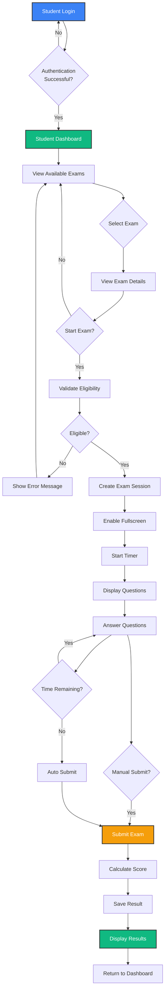
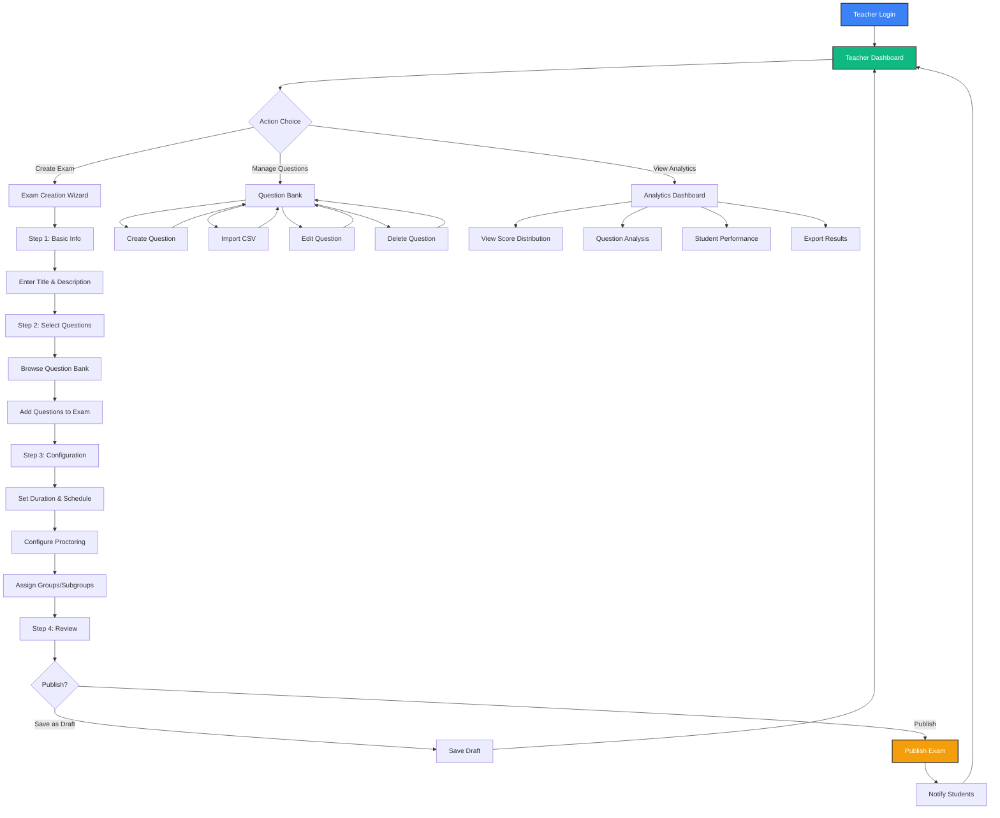
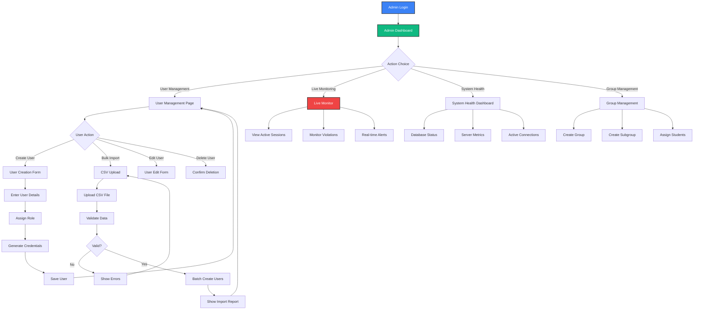
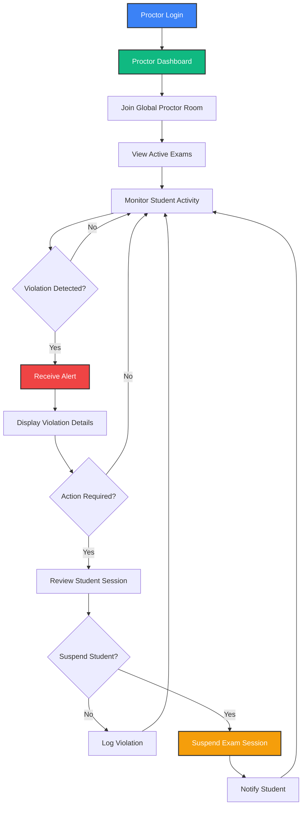
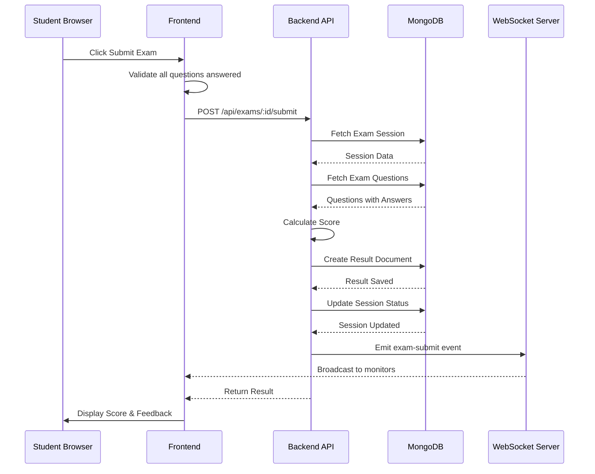
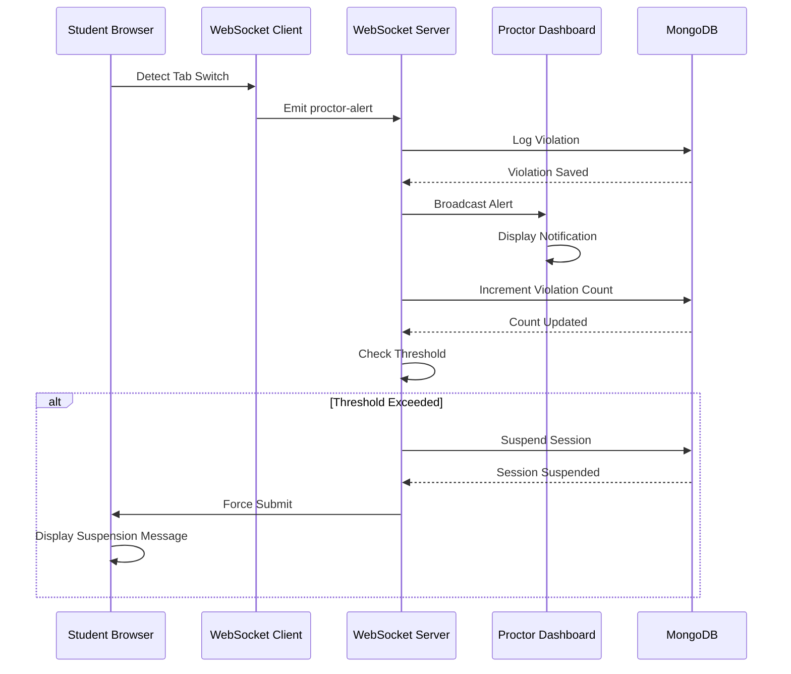
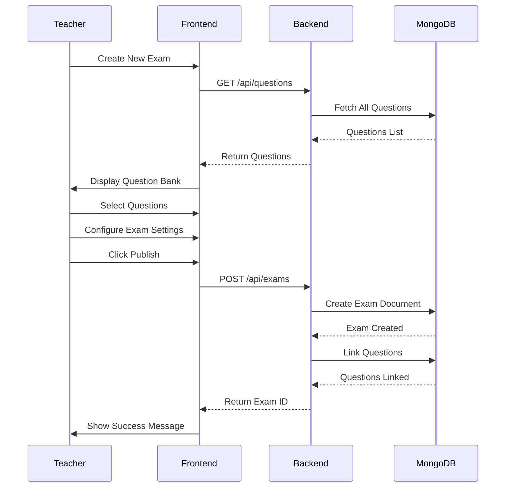
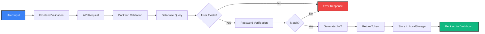
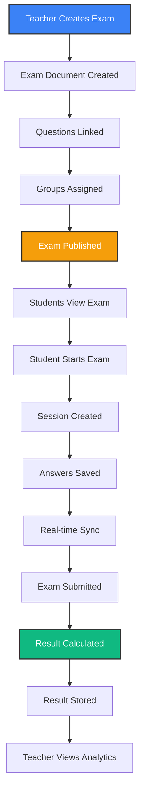
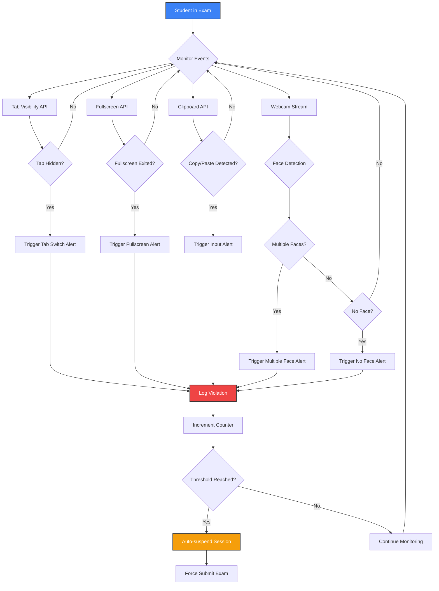

# SOEMS - User Flow & Feature Documentation
## Comprehensive User Journey and Feature Breakdown

---

## Table of Contents

1. [User Flow Diagrams](#1-user-flow-diagrams)
2. [Detailed Feature Breakdown](#2-detailed-feature-breakdown)
3. [Component Interaction Flows](#3-component-interaction-flows)
4. [Data Flow Architecture](#4-data-flow-architecture)
5. [Proctoring System Workflow](#5-proctoring-system-workflow)

---

## 1. User Flow Diagrams

### 1.1 Student Exam Taking Flow

### 1.2 Teacher Exam Creation Flow

### 1.3 Admin User Management Flow

### 1.4 Proctor Monitoring Flow

---

## 2. Detailed Feature Breakdown

### 2.1 Authentication System

#### 2.1.1 User Registration
- **Email Validation**: Real-time email format checking
- **Password Strength**: Minimum 8 characters with complexity requirements
- **Role Selection**: Student, Teacher, Admin, Proctor
- **Unique Constraints**: Email uniqueness verification
- **Auto-hashing**: Bcrypt password hashing on save

#### 2.1.2 User Login
- **Credential Verification**: Email and password matching
- **JWT Generation**: 30-day token with user payload
- **Role-based Redirect**: Automatic routing to role-specific dashboard
- **Remember Me**: Optional persistent login
- **Error Handling**: Clear error messages for invalid credentials

#### 2.1.3 Password Recovery
- **Security Questions**: Pre-configured questions for verification
- **Answer Verification**: Bcrypt comparison for security
- **Password Reset**: Ability to set new password
- **Email Notification**: Optional email confirmation

### 2.2 Student Features

#### 2.2.1 Dashboard
- **Upcoming Exams**: List of scheduled exams with countdown
- **Past Exams**: History of completed exams
- **Recent Results**: Quick view of latest scores
- **Performance Metrics**: Overall statistics and trends
- **Notifications**: Exam reminders and announcements

#### 2.2.2 Exam Interface
- **Question Navigation**:
  - Previous/Next buttons
  - Question palette with status indicators
  - Jump to specific question
  - Flag questions for review
  
- **Timer Management**:
  - Countdown display
  - Auto-save every 30 seconds
  - Warning at 5 minutes remaining
  - Auto-submit on time expiry
  
- **Answer Selection**:
  - Single-choice radio buttons
  - Clear selection option
  - Visual feedback on selection
  - Confirmation before submit
  
- **Proctoring Features**:
  - Fullscreen enforcement
  - Tab switch detection
  - Copy/paste prevention
  - Webcam monitoring (if enabled)
  - Violation counter display

#### 2.2.3 Results View
- **Score Summary**: Total score and percentage
- **Question-wise Breakdown**: Correct/incorrect indicators
- **Time Analysis**: Time spent per question
- **Correct Answers**: Display of correct options
- **Performance Comparison**: Rank among peers
- **Download Certificate**: PDF certificate generation

#### 2.2.4 Profile Management
- **Personal Information**: Name, email, phone, address
- **Avatar Upload**: Profile picture management
- **Bio**: Personal description
- **Institution**: Educational institution details
- **Password Change**: Secure password update
- **Theme Preference**: Light/dark mode toggle

### 2.3 Teacher Features

#### 2.3.1 Question Bank Management
- **Create Question**:
  - Question text editor
  - Multiple options (2-4)
  - Correct answer selection
  - Subject categorization
  - Difficulty level (easy/medium/hard)
  
- **Edit Question**:
  - Modify existing questions
  - Update options and answers
  - Change difficulty level
  
- **Delete Question**:
  - Confirmation dialog
  - Check for exam associations
  - Cascade handling
  
- **Bulk Import**:
  - CSV template download
  - File upload and validation
  - Error reporting
  - Batch creation
  - Import summary

#### 2.3.2 Exam Creation
- **Basic Information**:
  - Exam title
  - Description
  - Subject/course
  
- **Question Selection**:
  - Browse question bank
  - Filter by subject/difficulty
  - Add/remove questions
  - Question preview
  - Randomize order option
  
- **Scheduling**:
  - Start date and time
  - End date and time
  - Duration in minutes
  - Timezone handling
  
- **Proctoring Configuration**:
  - Enable/disable tab lock
  - Enable/disable fullscreen
  - Enable/disable input lock
  - Set violation threshold
  - Webcam requirement
  
- **Student Assignment**:
  - Select groups
  - Select subgroups
  - Individual student selection
  - Exclusion list
  
- **Publishing Options**:
  - Save as draft
  - Publish immediately
  - Schedule publication
  - Results visibility settings

#### 2.3.3 Exam Management
- **View Exams**: List of all created exams
- **Filter & Search**: By status, date, subject
- **Edit Exam**: Modify draft exams
- **Delete Exam**: Remove exam with confirmations
- **Duplicate Exam**: Clone existing exam
- **Archive Exam**: Move to archive
- **Publish Results**: Make results visible to students

#### 2.3.4 Analytics Dashboard
- **Score Distribution**:
  - Histogram chart
  - Mean, median, mode
  - Standard deviation
  - Pass/fail percentage
  
- **Question Analysis**:
  - Correct response rate per question
  - Average time spent per question
  - Difficulty assessment
  - Discrimination index
  
- **Student Performance**:
  - Top performers list
  - Bottom performers list
  - Individual student details
  - Performance trends
  
- **Comparison Metrics**:
  - Group-wise comparison
  - Subject-wise comparison
  - Historical comparison

#### 2.3.5 Report Generation
- **CSV Export**:
  - Student details
  - Scores and percentages
  - Question-wise answers
  - Time spent
  - Violation records
  
- **PDF Reports**:
  - Summary report
  - Detailed analysis
  - Charts and graphs
  - Custom branding

### 2.4 Admin Features

#### 2.4.1 User Management
- **Create User**:
  - Manual entry form
  - All user types
  - Credential generation
  - Email notification
  
- **Bulk Import**:
  - CSV template
  - Validation rules
  - Error handling
  - Success report
  
- **Edit User**:
  - Update details
  - Change role
  - Reset password
  - Activate/deactivate
  
- **Delete User**:
  - Soft delete option
  - Cascade handling
  - Data retention policy
  - Confirmation required

#### 2.4.2 Group Management
- **Create Group**:
  - Group name
  - Description
  - Department/course
  
- **Create Subgroup**:
  - Parent group selection
  - Subgroup name
  - Section/batch
  
- **Assign Students**:
  - Bulk assignment
  - Individual assignment
  - Move between groups
  - Remove from group

#### 2.4.3 Live Monitoring
- **Active Sessions**:
  - Real-time session count
  - Student list
  - Exam details
  - Time remaining
  
- **Violation Tracking**:
  - Live violation feed
  - Violation type breakdown
  - Student-wise violations
  - Auto-suspension alerts
  
- **System Metrics**:
  - Active users
  - Database connections
  - Server load
  - Response times

#### 2.4.4 System Health
- **Database Status**:
  - Connection status
  - Database size
  - Collection counts
  - Query performance
  
- **Server Metrics**:
  - CPU usage
  - Memory usage
  - Disk space
  - Network traffic
  
- **Application Health**:
  - Uptime
  - Error rates
  - API response times
  - WebSocket connections

### 2.5 Proctor Features

#### 2.5.1 Live Monitoring Dashboard
- **Active Exams**: List of ongoing exams
- **Student Activity**: Real-time student actions
- **Violation Alerts**: Instant notifications
- **Session Details**: Individual student sessions
- **Quick Actions**: Suspend, flag, message

#### 2.5.2 Violation Management
- **Alert Types**:
  - Tab switch
  - Fullscreen exit
  - Multiple faces
  - No face detected
  - Copy/paste attempt
  
- **Alert Details**:
  - Student information
  - Timestamp
  - Violation count
  - Screenshot (if available)
  
- **Actions**:
  - Log violation
  - Send warning
  - Suspend session
  - Contact student

---

## 3. Component Interaction Flows

### 3.1 Exam Submission Flow

### 3.2 Real-time Proctoring Flow

### 3.3 Question Bank to Exam Flow

---

## 4. Data Flow Architecture

### 4.1 Authentication Data Flow

### 4.2 Exam Data Flow

---

## 5. Proctoring System Workflow

### 5.1 Violation Detection System

### 5.2 Proctoring Configuration Matrix

| **Feature** | **Purpose** | **Detection Method** | **Action** |
|-------------|-------------|---------------------|------------|
| **Tab Lock** | Prevent tab switching | Visibility API | Log violation, warn student |
| **Fullscreen** | Ensure focused environment | Fullscreen API | Log violation, force fullscreen |
| **Input Lock** | Prevent copy/paste | Clipboard API | Block action, log violation |
| **Face Detection** | Verify student identity | Webcam + ML | Alert proctor, log violation |
| **Multiple Faces** | Detect cheating | Webcam + ML | Alert proctor, log violation |
| **Violation Threshold** | Auto-suspend cheaters | Counter check | Suspend session, force submit |

---

## Appendix: Feature Comparison Matrix

### Student vs Teacher vs Admin Features

| **Feature** | **Student** | **Teacher** | **Admin** | **Proctor** |
|-------------|-------------|-------------|-----------|-------------|
| **Dashboard** | ✅ | ✅ | ✅ | ✅ |
| **Take Exams** | ✅ | ❌ | ❌ | ❌ |
| **View Results** | ✅ (Own) | ✅ (All) | ✅ (All) | ❌ |
| **Create Exams** | ❌ | ✅ | ❌ | ❌ |
| **Create Questions** | ❌ | ✅ | ❌ | ❌ |
| **User Management** | ❌ | ❌ | ✅ | ❌ |
| **Group Management** | ❌ | ❌ | ✅ | ❌ |
| **Live Monitoring** | ❌ | ✅ (Own Exams) | ✅ (All) | ✅ (All) |
| **Analytics** | ✅ (Own) | ✅ (Own Exams) | ✅ (All) | ❌ |
| **Export Reports** | ❌ | ✅ | ✅ | ❌ |
| **System Health** | ❌ | ❌ | ✅ | ❌ |
| **Bulk Import** | ❌ | ✅ (Questions) | ✅ (Users) | ❌ |
| **Profile Edit** | ✅ | ✅ | ✅ | ✅ |
| **Theme Toggle** | ✅ | ✅ | ✅ | ✅ |

---

**Document End**
